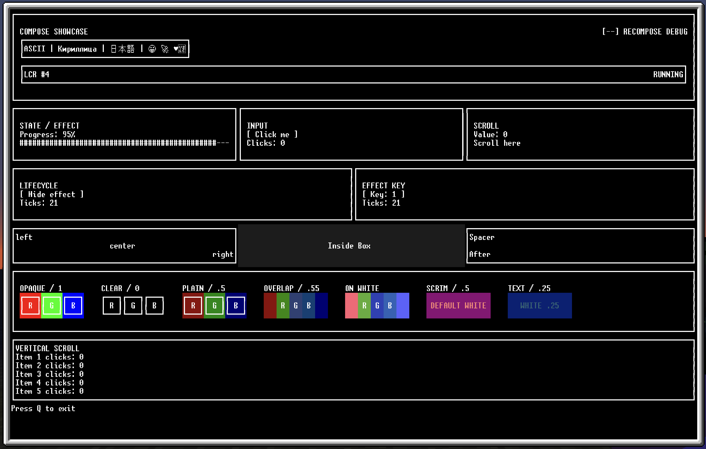
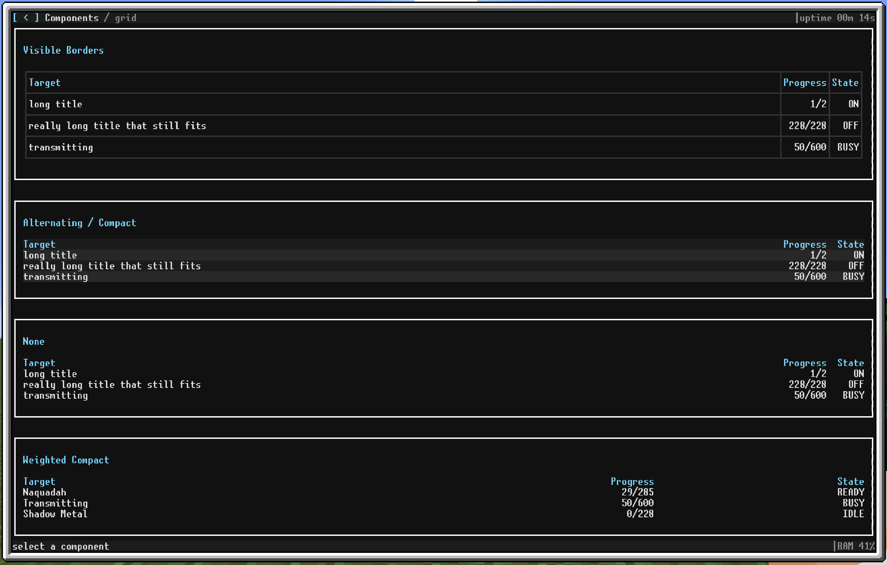

# OC

This is my persona repo of OC lua projects for GTNH

It contains
- Primitive packet manager for downloading only needed code.
- `Compose`-like ui framework
- Components for `Compose`
- Bunch of test
- Crafter - craft requester
- Dashboard - metrics dashboard for crafters




> [!NOTE]
> This project contains AI-generated code. See [AI_USAGE.md](AI_USAGE.md) for details.

## Install in OpenComputers

From an OpenOS computer:

```sh
wget -f https://raw.githubusercontent.com/fopwoc/oc/master/src/install.lua ./install.lua
./install.lua --help
```

List installed targets or run one directly:

```sh
./run.lua --help
./run.lua test_components
```
## Structure

- `src/install.lua` — transactional packet installer and remote manifest loader
- `src/run.lua` — installed target runner with module reload support
- `src/manifest.lua` — package graph, dependencies, files, and entrypoints
- `src/lib/compose` — runtime, layout, renderer, input, colors, navigation, and buffers
- `src/lib/components` — application-level TUI components
- `src/app` — dashboard and crafter applications
- `src/test` — suites intended to run inside OpenComputers
- `test` — host-side repository checks

The design and performance rationale are described in [ARCHITECTURE.md](ARCHITECTURE.md).
